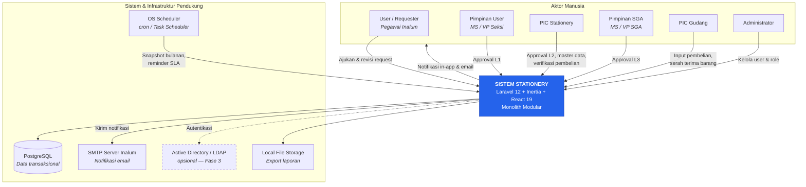
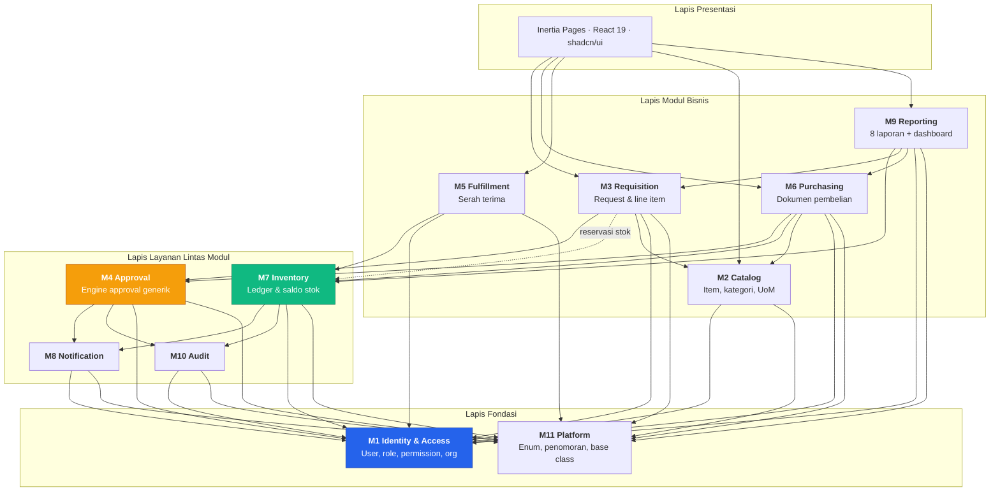
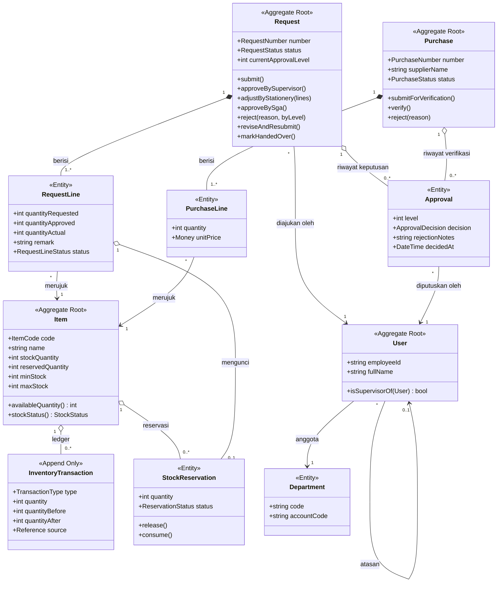
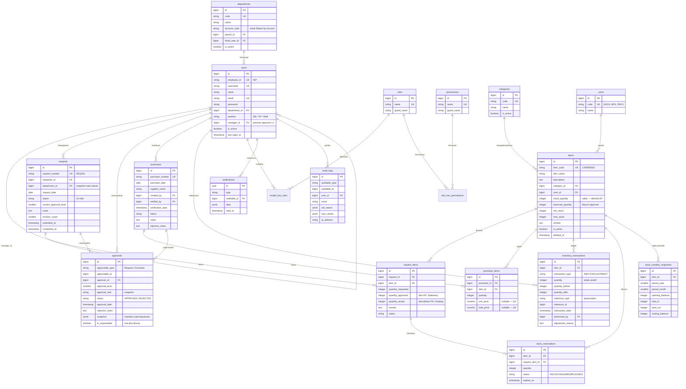
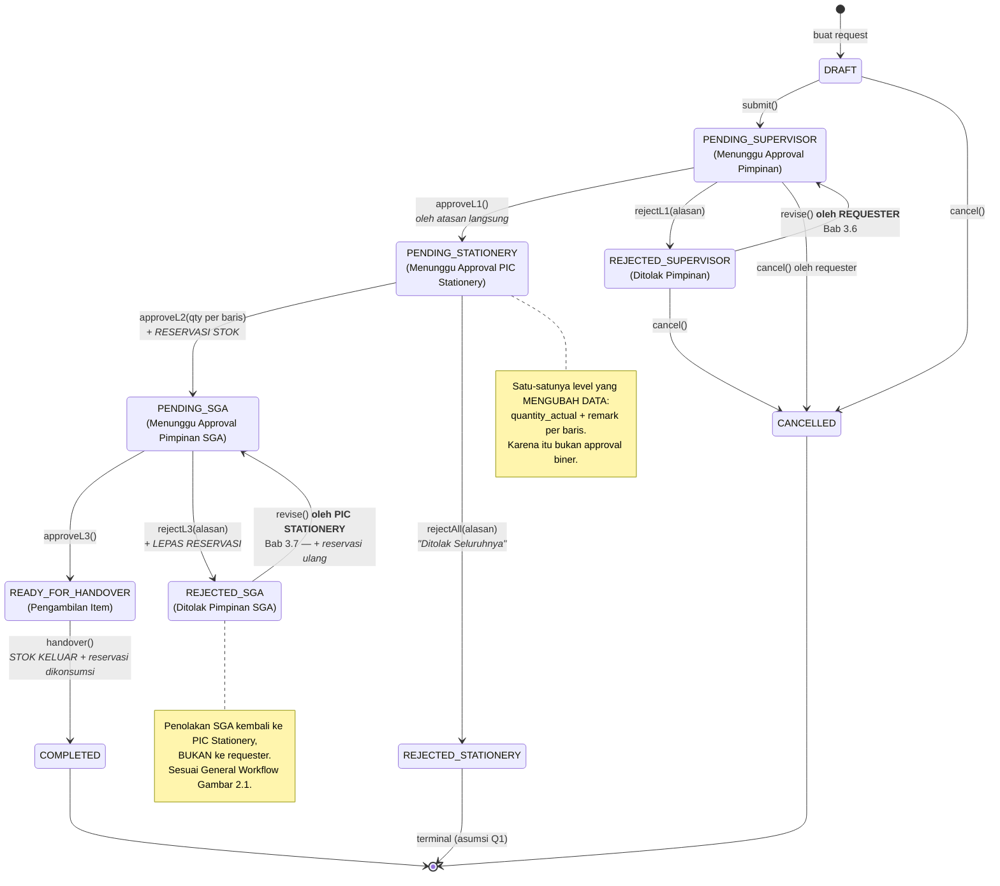
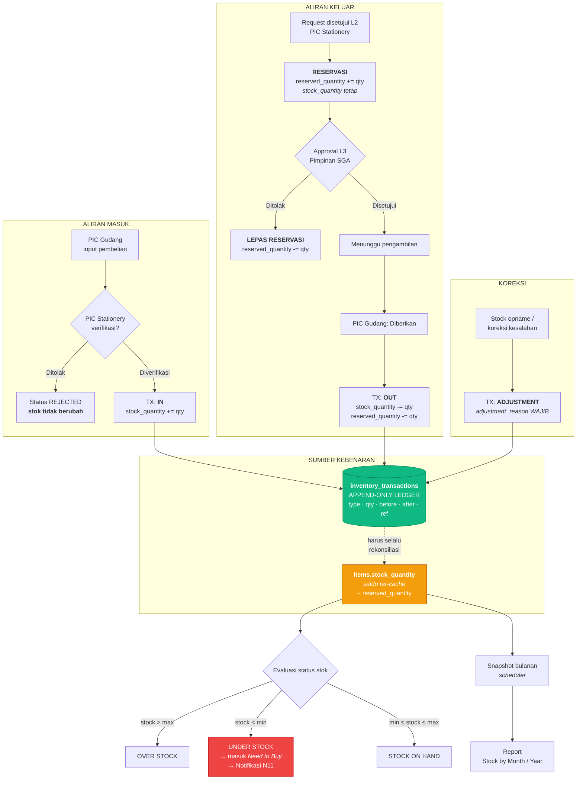

# Bagian 2 — Software Architecture Blueprint

**Sistem Stationery — PT Indonesia Asahan Aluminium**

| | |
|---|---|
| **Arsitektur** | Monolith Modular |
| **Backend** | Laravel 12 · PHP 8.4 |
| **Frontend** | React 19 · TypeScript · InertiaJS 2 |
| **UI** | TailwindCSS · shadcn/ui |
| **Database** | PostgreSQL 16+ |
| **Auth** | Laravel Built-in Auth + RBAC |
| **Deployment** | Standard Laravel (tanpa Docker) |

---

## 1. System Context Diagram

Batas sistem dan siapa/apa yang berinteraksi dengannya.



**Keputusan batas sistem:**

- Sistem **tidak** terintegrasi ke ERP/SAP pada Fase 1 — blueprint tidak menyebutkannya. Ledger inventory dirancang agar integrasi ini dapat ditambahkan tanpa membongkar model data.
- **LDAP/AD ditandai opsional.** Requirement mewajibkan *Laravel Built-in Authentication*, jadi Fase 1 memakai tabel `users` lokal. Struktur disiapkan agar SSO dapat menyusul.
- **Tidak ada integrasi supplier.** `supplier_name` adalah teks bebas sesuai wireframe 3.9.2.

---

## 2. Module Breakdown

### 2.1 Peta Modul & Ketergantungan



### 2.2 Aturan Ketergantungan (dijaga agar modularitas tidak luntur)

1. **Arah ketergantungan hanya ke bawah.** M1/M11 tidak boleh mengenal modul bisnis apa pun.
2. **Modul bisnis tidak boleh saling memanggil model** — komunikasi lintas modul melalui **Service publik** atau **Domain Event**.
3. **M7 (Inventory) adalah satu-satunya penulis stok.** Tidak ada modul lain yang boleh `UPDATE items.stock_quantity`. Ini adalah aturan paling penting dalam sistem ini.
4. **M4 (Approval) tidak mengenal Request maupun Purchase secara konkret** — ia bekerja pada kontrak `Approvable`.

### 2.3 Tanggung Jawab Detail

| Modul | Service Utama | Tanggung Jawab |
|---|---|---|
| M1 Identity | `UserService`, `RoleService` | CRUD user, assign role, resolusi atasan (`manager_id`) |
| M2 Catalog | `ItemService`, `CategoryService` | CRUD item, validasi `item_code` unik, min/max stock |
| M3 Requisition | `RequestService`, `RequestRevisionService` | Buat/ubah/ajukan/batalkan request, revisi pasca-penolakan |
| M4 Approval | `ApprovalService`, `RequestWorkflow`, `PurchaseWorkflow` | Validasi transisi, catat keputusan, tentukan approver berikutnya |
| M5 Fulfillment | `HandoverService` | Serah terima, memicu stok keluar |
| M6 Purchasing | `PurchaseService` | Buat pembelian, verifikasi, memicu stok masuk |
| M7 Inventory | `StockService`, `StockReservationService` | Ledger, saldo, reservasi, status stok |
| M8 Notification | `NotificationDispatcher` | Kirim notifikasi berbasis event, asinkron |
| M9 Reporting | `StockReportService`, `RequestReportService`, `PurchaseReportService` | 8 laporan + export |
| M10 Audit | `AuditLogger` | Rekam perubahan sensitif |
| M11 Platform | `DocumentNumberGenerator` | Nomor `REQ001`, `PO...` anti-duplikat |

---

## 3. Domain Model

Model konseptual — *bukan* tabel database. Menekankan aggregate, invariant, dan bahasa domain.



### 3.1 Invariant Domain

Aturan berikut **harus selalu benar**, apa pun jalur masuk data. Ditegakkan berlapis: Service (pesan error ramah) → constraint database (jaring pengaman).

| Aggregate / Entity | Invariant | Penegakan |
|---|---|---|
| `Request` | Tidak dapat diajukan tanpa minimal 1 baris item | `RequestService` |
| `Request` | Perubahan status hanya melalui `RequestWorkflow` | `RequestWorkflow` + `chk_requests_status` |
| `RequestLine` | `0 ≤ quantityApproved ≤ quantityRequested` | `chk_ri_qty_approved_range` |
| `RequestLine` | `0 ≤ quantityActual ≤ quantityApproved` | `chk_ri_qty_actual_range` |
| `Approval` | Immutable setelah dibuat — revisi menandai `is_superseded`, tidak menimpa | `ApprovalService` |
| `Approval` | Penolakan wajib disertai alasan | `chk_approvals_rejection_reason` |
| `Purchase` | Stok hanya bertambah saat `verify()` | `PurchaseWorkflow` |
| `Item` | `stockQuantity ≥ 0` | `chk_items_stock_non_negative` |
| `Item` | `reservedQuantity ≤ stockQuantity` | `chk_items_reserved_le_stock` |
| `Item` | `minStock ≤ maxStock` | `chk_items_min_le_max` |
| `InventoryTransaction` | **Append-only** — tidak pernah di-UPDATE/DELETE | `StockService` + code review |

### 3.2 Aggregate Boundary — dan alasannya

| Aggregate | Isi | Alasan Batas |
|---|---|---|
| **Request** | Request + RequestLine | Invariant `quantityActual <= quantityRequested` harus dijaga bersamaan. Line tidak bermakna tanpa header. |
| **Purchase** | Purchase + PurchaseLine | Idem. |
| **Item** | Item + saldo stok | Saldo adalah invariant paling kritis. Semua mutasi stok harus melewati aggregate ini dengan penguncian baris. |
| **Approval** | Berdiri sendiri, polymorphic | Dipakai dua aggregate; menjadikannya bagian dari Request akan menghalangi reuse untuk Purchase. |

**Konsekuensi penting:** Request dan Item adalah aggregate **terpisah**. Artinya mutasi stok saat serah terima terjadi melalui `StockService`, bukan dari dalam `Request`. Ini mencegah lock kontensi dan menjaga tanggung jawab tetap jelas.

---

## 4. Entity Relationship Diagram



### 4.1 Perbedaan terhadap ERD Blueprint — dan justifikasinya

| Perubahan | Alasan |
|---|---|
| `users.department` (teks) → tabel `departments` | Laporan *Request by Account* mustahil diagregasi dari teks bebas. Juga menampung `account_code`. |
| `users.role` (kolom) → tabel pivot RBAC | Satu user dapat memegang >1 peran (mis. Pimpinan yang juga Requester). Kolom tunggal tidak mampu. |
| `items.category` (teks) → `category_id` | Wireframe memakai 6 kategori tetap sebagai filter. |
| `approvals.request_id` → polymorphic | Approval juga dipakai Purchase. Menghindari duplikasi tabel & logika. |
| `+ items.reserved_quantity`, `+ stock_reservations` | Menutup celah *double-allocation* (Analisis §6.3). |
| `+ inventory_transactions.quantity_before/after` | Ledger dapat direkonsiliasi & drift terdeteksi. |
| `+ stock_monthly_snapshots` | Laporan *Stock by Month/Year* tetap cepat seiring bertambahnya data. |
| `+ requests.revision_count`, `approvals.is_superseded` | Riwayat revisi tetap utuh — approval lama tidak dihapus, hanya ditandai. |
| `items.status` → `is_active` + status stok terhitung | Menghilangkan ambiguitas antara "item aktif" dan "posisi stok". |

---

## 5. Role Permission Matrix

### 5.1 Matriks Kapabilitas

Legenda: ● = penuh · ◐ = terbatas kondisi (dijaga Policy) · ○ = tidak ada akses

| Kapabilitas | Requester | Pimpinan User | PIC Stationery | Pimpinan SGA | PIC Gudang | Admin |
|---|:---:|:---:|:---:|:---:|:---:|:---:|
| **Request** | | | | | | |
| `request.create` | ● | ● | ● | ● | ● | ● |
| `request.view.own` | ● | ● | ● | ● | ● | ● |
| `request.view.subordinate` | ○ | ◐ | ○ | ○ | ○ | ● |
| `request.view.all` | ○ | ○ | ● | ● | ● | ● |
| `request.update` | ◐ *draft/ditolak L1, milik sendiri* | ◐ | ◐ *ditolak L3* | ○ | ○ | ○ |
| `request.submit` | ◐ *milik sendiri* | ◐ | ◐ | ○ | ○ | ○ |
| `request.cancel` | ◐ *sebelum approve L1* | ○ | ○ | ○ | ○ | ● |
| **Approval Request** | | | | | | |
| `request.approve.l1` | ○ | ◐ *hanya bawahan langsung* | ○ | ○ | ○ | ○ |
| `request.approve.l2` | ○ | ○ | ● | ○ | ○ | ○ |
| `request.approve.l3` | ○ | ○ | ○ | ● | ○ | ○ |
| `request.handover` | ○ | ○ | ○ | ○ | ● | ○ |
| **Master Data** | | | | | | |
| `item.view` | ● | ● | ● | ● | ● | ● |
| `item.create` / `item.update` | ○ | ○ | ● | ○ | ○ | ● |
| `item.delete` | ○ | ○ | ○ | ○ | ○ | ● |
| `category.manage` / `uom.manage` | ○ | ○ | ● | ○ | ○ | ● |
| **Purchasing** | | | | | | |
| `purchase.create` | ○ | ○ | ○ | ○ | ● | ● |
| `purchase.view` | ○ | ○ | ● | ● | ● | ● |
| `purchase.update` | ○ | ○ | ○ | ○ | ◐ *draft/ditolak* | ○ |
| `purchase.verify` | ○ | ○ | ● | ○ | ○ | ○ |
| **Inventory** | | | | | | |
| `inventory.view` | ○ | ○ | ● | ● | ● | ● |
| `inventory.adjust` | ○ | ○ | ◐ *wajib alasan* | ○ | ○ | ● |
| **Reporting** | | | | | | |
| `report.stock.*` | ○ | ○ | ● | ● | ● | ● |
| `report.request.*` | ○ | ◐ *unit sendiri* | ● | ● | ○ | ● |
| `report.purchasing` | ○ | ○ | ● | ● | ● | ● |
| `report.need_to_buy` | ○ | ○ | ● | ● | ● | ● |
| `report.export` | ○ | ◐ | ● | ● | ● | ● |
| **Administrasi** | | | | | | |
| `user.manage` / `role.manage` | ○ | ○ | ○ | ○ | ○ | ● |
| `audit.view` | ○ | ○ | ○ | ○ | ○ | ● |

### 5.2 Mengapa Permission Saja Tidak Cukup

Tanda ◐ menandakan aturan yang **tidak dapat diekspresikan sebagai permission statis**. Contoh paling kritis:

> `request.approve.l1` — Seorang Pimpinan hanya boleh menyetujui request dari **bawahan langsungnya sendiri**, pada request yang berstatus **tepat** `PENDING_SUPERVISOR`.

Jika hanya mengandalkan permission role, Pimpinan Seksi A dapat menyetujui request Seksi B. Karena itu setiap ◐ **wajib** ditegakkan oleh Laravel Policy:

```
RequestPolicy::approveL1(User $user, Request $request): bool
    → $request->status === PENDING_SUPERVISOR
    && $request->requester->manager_id === $user->id
    && $user->hasPermissionTo('request.approve.l1')
```

**Aturan tim:** setiap Controller action yang mengubah state **wajib** memanggil `authorize()`. Tidak ada pengecualian. Pemeriksaan permission di sisi React hanyalah untuk menyembunyikan tombol — **bukan** kontrol keamanan.

---

## 6. Request Workflow State Diagram



### 6.1 Tabel Transisi (kontrak implementasi)

| Dari | Aksi | Ke | Aktor | Guard | Efek Samping |
|---|---|---|---|---|---|
| `DRAFT` | submit | `PENDING_SUPERVISOR` | Requester | ≥1 baris; semua item aktif | Notif N1 |
| `PENDING_SUPERVISOR` | approveL1 | `PENDING_STATIONERY` | Pimpinan User | `requester.manager_id == user.id` | Notif N2 |
| `PENDING_SUPERVISOR` | rejectL1 | `REJECTED_SUPERVISOR` | Pimpinan User | alasan wajib | Notif N3 |
| `REJECTED_SUPERVISOR` | revise | `PENDING_SUPERVISOR` | **Requester** | pemilik request | `revision_count++`, approval lama `is_superseded` |
| `PENDING_STATIONERY` | approveL2 | `PENDING_SGA` | PIC Stationery | `0 ≤ qty_actual ≤ qty_requested`; stok tersedia cukup | **Buat reservasi**, Notif N4 |
| `PENDING_STATIONERY` | rejectAll | `REJECTED_STATIONERY` | PIC Stationery | alasan wajib | Notif N5 |
| `PENDING_SGA` | approveL3 | `READY_FOR_HANDOVER` | Pimpinan SGA | — | Notif N6 |
| `PENDING_SGA` | rejectL3 | `REJECTED_SGA` | Pimpinan SGA | alasan wajib | **Lepas reservasi**, Notif N7 |
| `REJECTED_SGA` | revise | `PENDING_SGA` | **PIC Stationery** | — | Reservasi ulang, `is_superseded` |
| `READY_FOR_HANDOVER` | handover | `COMPLETED` | PIC Gudang | stok fisik cukup | **Stok OUT**, konsumsi reservasi, Notif N8 |

**Penegakan:** transisi diimplementasikan sebagai satu tabel deklaratif di `RequestWorkflow`, bukan `if/else` yang tersebar. Transisi tak sah melempar `InvalidStateTransitionException`. Ini membuat penambahan level approval di masa depan menjadi perubahan satu berkas.

---

## 7. Purchasing Workflow State Diagram

```mermaid
stateDiagram-v2
    direction LR
    [*] --> DRAFT : PIC Gudang buat pembelian

    DRAFT --> PENDING_VERIFICATION : submit()<br/><i>tombol Simpan</i>
    DRAFT --> [*] : discard

    state "PENDING_VERIFICATION<br/>(Menunggu Verifikasi)" as PENDING_VERIFICATION
    PENDING_VERIFICATION --> VERIFIED : verify()<br/>oleh PIC Stationery
    PENDING_VERIFICATION --> REJECTED : reject(alasan)

    state "VERIFIED<br/>(Diverifikasi)" as VERIFIED
    state "REJECTED<br/>(Ditolak)" as REJECTED

    REJECTED --> PENDING_VERIFICATION : revise()<br/>oleh PIC Gudang

    VERIFIED --> [*]

    note right of VERIFIED
        <b>SATU-SATUNYA titik stok BERTAMBAH.</b>
        InventoryTransaction type = IN
        dibuat per baris pembelian,
        di dalam DB transaction yang sama.
    end note

    note left of PENDING_VERIFICATION
        Stok BELUM bertambah di sini.
        Menaikkan stok saat input akan
        memaksa koreksi negatif bila ditolak
        dan merusak integritas ledger.
    end note
```



| Dari | Aksi | Ke | Aktor | Efek Samping |
|---|---|---|---|---|
| `DRAFT` | submit | `PENDING_VERIFICATION` | PIC Gudang | Notif N9 |
| `PENDING_VERIFICATION` | verify | `VERIFIED` | PIC Stationery | **Stok IN** + ledger + cek `min_stock` → Notif N10 |
| `PENDING_VERIFICATION` | reject | `REJECTED` | PIC Stationery | Notif N10 (alasan wajib) |
| `REJECTED` | revise | `PENDING_VERIFICATION` | PIC Gudang | Approval lama `is_superseded` |

---

## 8. Inventory Flow Diagram



### 8.1 Aturan Integritas Stok — tidak boleh dilanggar

1. **Tidak ada kode di luar `StockService` yang boleh menulis `items.stock_quantity`.** Ditegakkan lewat code review dan test arsitektur.
2. **Setiap mutasi stok wajib menghasilkan satu baris `inventory_transactions`.** Tidak ada mutasi senyap.
3. **Semua mutasi berjalan dalam DB transaction dengan pessimistic lock:**
   ```
   SELECT ... FROM items WHERE id = ? FOR UPDATE
   ```
   Tanpa ini, dua serah terima bersamaan atas item yang sama akan menghasilkan saldo salah. `lockForUpdate()` di Eloquent.
4. **Ledger bersifat append-only.** Koreksi = transaksi `ADJUSTMENT` baru, bukan UPDATE.
5. **`CHECK (stock_quantity >= 0)` di level database** sebagai jaring pengaman terakhir bila ada bug di lapisan aplikasi.
6. **Job rekonsiliasi berkala** membandingkan `SUM(ledger)` vs `stock_quantity`; selisih memicu peringatan ke Administrator.

---

## 9. Architecture Decision Records

Setiap keputusan disertai alasan, sesuai ketentuan.

### ADR-01 — Monolith Modular, bukan Microservice
**Keputusan:** satu aplikasi Laravel dengan batas modul di dalam kode.
**Alasan:** volume ATK internal satu perusahaan jauh di bawah ambang yang membenarkan biaya distribusi. Microservice akan menambah kompleksitas jaringan, konsistensi eventual, dan observability tanpa manfaat nyata — sementara tim yang merawat adalah **tim IT internal**. Modularitas dijaga lewat disiplin namespace + aturan ketergantungan (§2.2), sehingga bila suatu saat perlu dipecah, batasnya sudah jelas.

### ADR-02 — Modularisasi lewat Namespace, bukan Paket Terpisah
**Keputusan:** modul berupa folder ber-namespace di dalam `app/Modules/`, satu `ServiceProvider` per modul. **Tidak** memakai `nwidart/laravel-modules` maupun paket Composer terpisah.
**Alasan:** paket pihak ketiga menambah lapisan abstraksi (auto-discovery, publishing, struktur non-standar) yang harus dipelajari terpisah dari Laravel. Untuk tim internal, struktur folder PSR-4 biasa lebih mudah dinavigasi, tidak berisiko saat upgrade Laravel, dan tetap memberi isolasi yang cukup.
**Konsekuensi:** batas modul dijaga oleh konvensi + review, bukan dipaksa oleh tooling. Diterima karena tim berukuran kecil.

### ADR-03 — Service Layer sebagai tempat logika bisnis (wajib)
**Keputusan:** Controller hanya melakukan: authorize → validate → panggil Service → kembalikan response Inertia. Seluruh logika bisnis dan orkestrasi transaksi ada di Service.
**Alasan:** logika approval sistem ini melibatkan banyak entitas sekaligus (request, stok, reservasi, approval, notifikasi) dalam satu transaksi atomik. Menaruhnya di Controller membuatnya tak dapat diuji dan tak dapat dipakai ulang oleh Command/Job. Service juga menjadi titik tunggal `DB::transaction()`.

### ADR-04 — Repository Pattern hanya secara selektif
**Keputusan:** **tidak** membuat repository untuk CRUD biasa. Eloquent dipakai langsung di dalam Service. Repository/Query Object dibuat **hanya** untuk:
- Query laporan kompleks (`ReportQuery` — agregasi multi-tabel, 8 laporan)
- Query ledger stok yang butuh SQL khusus (window function untuk saldo berjalan)

**Alasan:** Eloquent sudah merupakan abstraksi persistence (Active Record). Membungkusnya lagi menghasilkan boilerplate tanpa manfaat — Laravel tidak akan diganti ORM-nya, dan test dapat memakai database transaksional. Namun query laporan berupa SQL agregat panjang **memang** layak diisolasi agar tidak mengotori Service dan mudah dioptimasi. Ini persis kondisi "hanya jika memang diperlukan" pada requirement.

### ADR-05 — Mesin Status Deklaratif Buatan Sendiri
**Keputusan:** enum PHP 8.4 + kelas `RequestWorkflow` berisi tabel transisi, tanpa paket state machine eksternal.
**Alasan:** hanya ada dua workflow dengan total belasan transisi. Paket seperti `spatie/laravel-model-states` menambah konsep (state class per status) yang berlebihan untuk skala ini. Tabel transisi eksplisit dapat dibaca sekali pandang oleh developer baru dan mudah dipetakan langsung ke §6.1.

### ADR-06 — RBAC memakai `spatie/laravel-permission` + Laravel Policy
**Keputusan:** permission & role disimpan lewat paket Spatie; keputusan kontekstual ditegakkan Policy.
**Alasan:** membuat RBAC sendiri berarti menulis ulang caching permission, middleware, dan direktif Blade/helper yang sudah teruji luas. Spatie adalah standar de-facto ekosistem Laravel dengan dokumentasi baik — nilai plus untuk tim internal. Yang **tidak** boleh didelegasikan ke paket adalah aturan kontekstual (§5.2); itu ranah Policy Laravel bawaan.

### ADR-07 — Reservasi Stok saat Approval L2
**Keputusan:** kuantitas yang disetujui PIC Stationery langsung direservasi. Stok tersedia = `stock_quantity - reserved_quantity`.
**Alasan:** tanpa reservasi, dua request dapat disetujui atas stok fisik yang sama (Analisis §6.3), menghasilkan janji yang tak dapat dipenuhi PIC Gudang dan potensi stok negatif. Reservasi menjaga agar angka yang dilihat PIC Stationery saat menyetujui tetap berlaku sampai serah terima.
**Alternatif ditolak:** validasi hanya saat serah terima — terlalu terlambat, kegagalan baru terlihat setelah melewati approval SGA.
**Konsekuensi:** perlu job pembersih reservasi yang menggantung (`expires_at`) untuk request yang tidak pernah diambil.

### ADR-08 — Saldo Stok Ter-cache + Ledger sebagai Sumber Kebenaran
**Keputusan:** `items.stock_quantity` menyimpan saldo, `inventory_transactions` menyimpan riwayat; keduanya ditulis dalam satu transaksi dengan `lockForUpdate()`.
**Alasan:** menghitung saldo dari `SUM(ledger)` setiap kali akan melambat seiring waktu dan membuat daftar item (dengan stok) menjadi mahal. Menyimpan saldo saja menghilangkan auditability yang justru diwajibkan Bab 1. Kombinasi keduanya + job rekonsiliasi memberi kecepatan sekaligus dapat diaudit.

### ADR-09 — Enum sebagai `varchar` + `CHECK`, bukan tipe ENUM PostgreSQL
**Keputusan:** kolom status memakai `varchar` dengan `CHECK` constraint, di-cast ke PHP Enum.
**Alasan:** mengubah tipe ENUM native PostgreSQL memerlukan `ALTER TYPE` yang merepotkan dalam migrasi dan tidak dapat di-rollback dengan bersih. `varchar + CHECK` memberi validasi setara namun mudah dievolusi — penting karena status workflow berpotensi bertambah.

### ADR-10 — Inertia SSR dimatikan pada Fase 1
**Keputusan:** SPA client-side rendering saja.
**Alasan:** ini aplikasi internal di balik login — SEO tidak relevan, dan SSR menambah proses Node yang harus dijaga di server produksi. Bertentangan dengan tujuan kemudahan operasional non-Docker. Dapat diaktifkan nanti tanpa mengubah kode halaman.

### ADR-11 — Queue driver `database`
**Keputusan:** notifikasi & job berat memakai queue driver `database`, bukan Redis.
**Alasan:** deployment non-Docker standar; menambah Redis berarti satu layanan lagi yang harus dipasang, diamankan, dan dipantau oleh tim internal. Volume notifikasi sistem ATK sangat rendah — PostgreSQL lebih dari cukup. Dapat dipindah ke Redis hanya dengan mengubah `.env` bila kelak diperlukan.

### ADR-12 — Notifikasi dikirim setelah commit
**Keputusan:** memakai `DB::afterCommit()` / `ShouldQueue` pada notification.
**Alasan:** bila notifikasi dikirim di dalam transaksi lalu transaksi gagal, pengguna menerima kabar approval yang sebenarnya tidak tersimpan — kesalahan yang mahal untuk dokumen approval.

---

## 10. Folder Structure Project

```
taajri-stationery/
├── app/
│   ├── Console/
│   │   └── Commands/
│   │       ├── GenerateMonthlyStockSnapshot.php
│   │       ├── ReconcileStockBalance.php
│   │       └── SendPendingApprovalReminder.php
│   │
│   ├── Modules/                          ← BATAS MODUL (ADR-02)
│   │   │
│   │   ├── Identity/
│   │   │   ├── Models/                   User.php, Department.php
│   │   │   ├── Services/                 UserService.php, RoleService.php
│   │   │   ├── Http/
│   │   │   │   ├── Controllers/          UserController.php, RoleController.php
│   │   │   │   └── Requests/             StoreUserRequest.php
│   │   │   ├── Policies/                 UserPolicy.php
│   │   │   └── IdentityServiceProvider.php
│   │   │
│   │   ├── Catalog/
│   │   │   ├── Models/                   Item.php, Category.php, Uom.php
│   │   │   ├── Services/                 ItemService.php
│   │   │   ├── Http/Controllers/         ItemController.php, CategoryController.php
│   │   │   ├── Http/Requests/            StoreItemRequest.php, UpdateItemRequest.php
│   │   │   ├── Policies/                 ItemPolicy.php
│   │   │   └── CatalogServiceProvider.php
│   │   │
│   │   ├── Requisition/
│   │   │   ├── Models/                   Request.php, RequestItem.php
│   │   │   ├── Enums/                    RequestStatus.php, RequestItemStatus.php
│   │   │   ├── Services/                 RequestService.php, RequestRevisionService.php
│   │   │   ├── Workflows/                RequestWorkflow.php   ← tabel transisi (ADR-05)
│   │   │   ├── Events/                   RequestSubmitted.php, RequestApproved.php,
│   │   │   │                             RequestRejected.php, RequestCompleted.php
│   │   │   ├── Http/Controllers/         RequestController.php,
│   │   │   │                             RequestApprovalController.php
│   │   │   ├── Http/Requests/            StoreRequestRequest.php, ApproveL2Request.php
│   │   │   ├── Policies/                 RequestPolicy.php     ← aturan ◐ (§5.2)
│   │   │   └── RequisitionServiceProvider.php
│   │   │
│   │   ├── Approval/
│   │   │   ├── Models/                   Approval.php
│   │   │   ├── Contracts/                Approvable.php
│   │   │   ├── Enums/                    ApprovalDecision.php, ApprovalLevel.php
│   │   │   ├── Services/                 ApprovalService.php
│   │   │   ├── Exceptions/               InvalidStateTransitionException.php
│   │   │   └── ApprovalServiceProvider.php
│   │   │
│   │   ├── Fulfillment/
│   │   │   ├── Services/                 HandoverService.php
│   │   │   ├── Http/Controllers/         HandoverController.php
│   │   │   └── FulfillmentServiceProvider.php
│   │   │
│   │   ├── Purchasing/
│   │   │   ├── Models/                   Purchase.php, PurchaseItem.php
│   │   │   ├── Enums/                    PurchaseStatus.php
│   │   │   ├── Services/                 PurchaseService.php
│   │   │   ├── Workflows/                PurchaseWorkflow.php
│   │   │   ├── Events/                   PurchaseVerified.php, PurchaseRejected.php
│   │   │   ├── Http/Controllers/         PurchaseController.php,
│   │   │   │                             PurchaseVerificationController.php
│   │   │   ├── Policies/                 PurchasePolicy.php
│   │   │   └── PurchasingServiceProvider.php
│   │   │
│   │   ├── Inventory/
│   │   │   ├── Models/                   InventoryTransaction.php,
│   │   │   │                             StockReservation.php, StockMonthlySnapshot.php
│   │   │   ├── Enums/                    TransactionType.php, StockStatus.php
│   │   │   ├── Services/                 StockService.php          ← SATU-SATUNYA penulis stok
│   │   │   │                             StockReservationService.php
│   │   │   ├── Queries/                  StockLedgerQuery.php      ← ADR-04
│   │   │   ├── Exceptions/               InsufficientStockException.php
│   │   │   ├── Http/Controllers/         InventoryController.php
│   │   │   └── InventoryServiceProvider.php
│   │   │
│   │   ├── Notification/
│   │   │   ├── Notifications/            RequestSubmittedNotification.php, ...
│   │   │   ├── Listeners/                SendRequestNotification.php
│   │   │   ├── Services/                 NotificationDispatcher.php
│   │   │   ├── Http/Controllers/         NotificationController.php
│   │   │   └── NotificationServiceProvider.php
│   │   │
│   │   ├── Reporting/
│   │   │   ├── Queries/                  StockByPeriodQuery.php, RequestByAccountQuery.php,
│   │   │   │                             RequestByItemQuery.php, NeedToBuyQuery.php,
│   │   │   │                             PurchasingReportQuery.php
│   │   │   ├── Services/                 ReportService.php, ReportExportService.php
│   │   │   ├── Exports/                  StockReportExport.php (Laravel Excel)
│   │   │   ├── Http/Controllers/         ReportController.php, DashboardController.php
│   │   │   └── ReportingServiceProvider.php
│   │   │
│   │   └── Audit/
│   │       ├── Models/                   AuditLog.php
│   │       ├── Services/                 AuditLogger.php
│   │       ├── Observers/                AuditableObserver.php
│   │       ├── Http/Controllers/         AuditLogController.php
│   │       └── AuditServiceProvider.php
│   │
│   ├── Shared/                           ← M11 Platform
│   │   ├── Concerns/                     HasDocumentNumber.php, Auditable.php
│   │   ├── Services/                     DocumentNumberGenerator.php
│   │   ├── Enums/                        Concerns/HasLabel.php
│   │   ├── Exceptions/                   BusinessRuleException.php
│   │   └── Support/                      Money.php
│   │
│   ├── Http/
│   │   └── Middleware/                   HandleInertiaRequests.php
│   └── Providers/                        AppServiceProvider.php
│
├── bootstrap/
│   ├── app.php                           routing, middleware, exception handling,
│   │                                     withSchedule() — pengganti Http/Kernel.php
│   └── providers.php                     registrasi ServiceProvider tiap modul
│
├── database/
│   ├── migrations/                       urut kronologis, satu tabel per berkas
│   ├── seeders/
│   │   ├── RolePermissionSeeder.php      ← matriks §5.1
│   │   ├── DepartmentSeeder.php
│   │   ├── CategorySeeder.php            ← 6 kategori dari wireframe
│   │   ├── UomSeeder.php
│   │   └── DemoDataSeeder.php
│   └── factories/
│
├── resources/
│   ├── js/
│   │   ├── app.tsx
│   │   ├── types/
│   │   │   ├── index.d.ts
│   │   │   └── models.d.ts               ← selaras dengan Data/DTO backend
│   │   ├── lib/                          utils.ts (cn), api.ts, formatters.ts
│   │   ├── hooks/                        use-permission.ts, use-toast.ts
│   │   ├── components/
│   │   │   ├── ui/                       ← shadcn/ui (generated)
│   │   │   ├── layouts/                  AuthenticatedLayout.tsx, GuestLayout.tsx
│   │   │   ├── shared/                   DataTable.tsx, StatusBadge.tsx,
│   │   │   │                             ApprovalTimeline.tsx, ItemPicker.tsx,
│   │   │   │                             QuantityStepper.tsx, PageHeader.tsx
│   │   │   └── charts/                   dashboard
│   │   └── pages/                        ← cerminan modul backend
│   │       ├── Dashboard/
│   │       ├── Requests/                 Create.tsx, Index.tsx, Show.tsx,
│   │       │                             Verify/Index.tsx, Verify/Show.tsx,
│   │       │                             Revise.tsx
│   │       ├── Items/                    Index.tsx, Create.tsx, Edit.tsx
│   │       ├── Purchases/                Create.tsx, Index.tsx, Show.tsx,
│   │       │                             Verify/Index.tsx, Verify/Show.tsx
│   │       ├── Inventory/                Index.tsx
│   │       ├── Reports/                  StockByMonth.tsx, NeedToBuy.tsx, ...
│   │       ├── Notifications/
│   │       └── Admin/                    Users/, Roles/, AuditLogs/
│   ├── css/app.css
│   └── views/app.blade.php
│
├── routes/
│   ├── web.php                           hanya memuat berkas per modul
│   ├── modules/                          identity.php, catalog.php, requisition.php,
│   │                                     purchasing.php, inventory.php, reporting.php
│   ├── auth.php
│   └── console.php
│
├── tests/
│   ├── Feature/                          per modul — fokus pada alur approval
│   │   ├── Requisition/RequestWorkflowTest.php
│   │   ├── Inventory/StockConcurrencyTest.php   ← wajib
│   │   └── Purchasing/PurchaseVerificationTest.php
│   ├── Unit/
│   └── Architecture/ArchitectureTest.php ← menjaga aturan §2.2 (Pest arch)
│
├── docs/architecture/                    dokumen ini
├── components.json                       shadcn/ui
├── tailwind.config.ts
├── vite.config.ts
├── tsconfig.json
└── composer.json
```

> **Catatan skeleton Laravel 12.** Sejak Laravel 11, `app/Http/Kernel.php` dan `app/Console/Kernel.php` **tidak lagi ada**. Konfigurasi middleware, routing, exception handling, dan penjadwalan dipusatkan di `bootstrap/app.php`; registrasi ServiceProvider tiap modul dilakukan di `bootstrap/providers.php`. Dari provider bawaan, hanya `AppServiceProvider` yang tersisa — Policy didaftarkan lewat auto-discovery atau `Gate::policy()` di dalam ServiceProvider modul masing-masing.

**Alasan struktur ini:**
- `app/Modules/` tetap PSR-4 standar — tidak ada tooling khusus (ADR-02)
- Struktur `resources/js/pages/` **mencerminkan** modul backend, sehingga developer yang mengubah fitur menemukan kedua sisi di tempat yang mudah ditebak
- `tests/Architecture/` menegakkan aturan ketergantungan secara otomatis — ini yang mencegah modularitas luntur seiring waktu, dan menutup kelemahan ADR-02

---

**Lanjut ke:** [Bagian 3 — Database Schema Draft](03-database-schema.md) · [Bagian 4 — Development Roadmap](04-roadmap.md)
