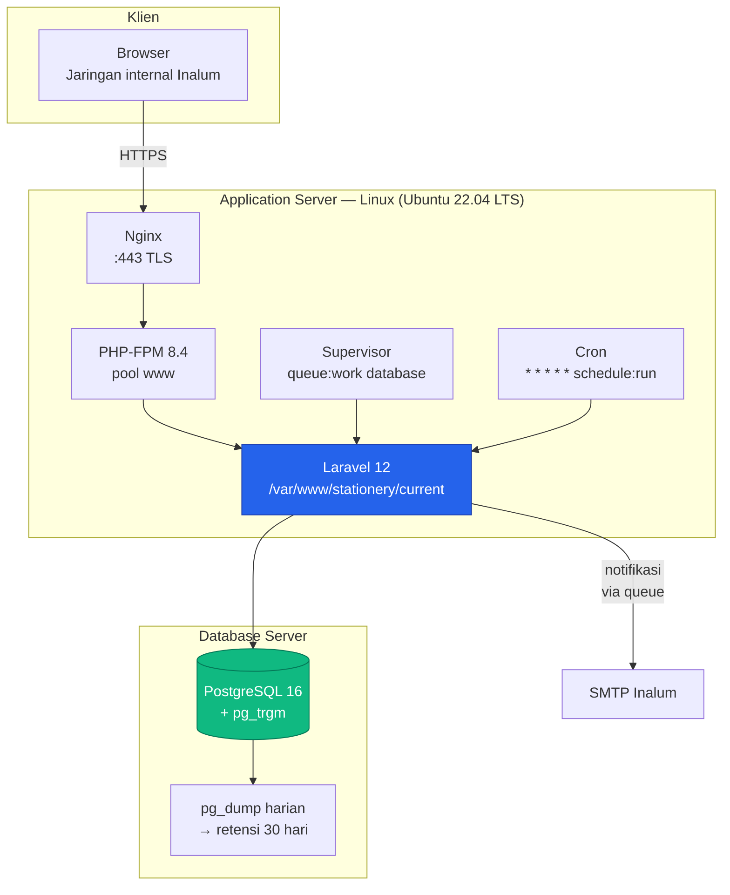

# Bagian 4 — Development Roadmap

**Asumsi tim:** 1 Tech Lead, 2 Fullstack Developer (Laravel + React), 1 QA paruh waktu.
**Satuan sprint:** 1 sprint = 2 minggu kerja.
**Estimasi bersifat indikatif** dan perlu dikalibrasi ulang setelah Sprint 0 selesai.

---

## Prinsip Urutan Pengerjaan

Roadmap disusun mengikuti **arah ketergantungan modul** (Blueprint §2.2), bukan urutan menu di layar:

1. **Fondasi dulu** — modul yang dipakai semua orang (Identity, Catalog, Platform) harus stabil sebelum alur transaksi dibangun di atasnya.
2. **Inventory sebelum transaksi** — `StockService` adalah satu-satunya penulis stok; ia harus benar dan teruji sebelum Requisition/Purchasing memanggilnya. Membalik urutan ini berarti menulis ulang.
3. **Purchasing sebelum Requisition** — alur pembelian jauh lebih sederhana (1 level approval) dan **mengisi stok**. Tanpa stok, alur request tidak dapat diuji secara realistis.
4. **Reporting terakhir** — laporan membaca dari semua modul; membangunnya lebih awal berarti mengejar skema yang masih berubah.

```mermaid
flowchart LR
    S0["Sprint 0<br/>Fondasi"] --> S1["Sprint 1–2<br/>Identity + RBAC"]
    S1 --> S2["Sprint 3<br/>Catalog"]
    S2 --> S3["Sprint 4<br/><b>Inventory Core</b>"]
    S3 --> S4["Sprint 5–6<br/>Purchasing"]
    S4 --> S5["Sprint 7–9<br/><b>Requisition + Approval</b>"]
    S5 --> S6["Sprint 10<br/>Fulfillment"]
    S6 --> S7["Sprint 11–12<br/>Reporting"]
    S7 --> S8["Sprint 13<br/>Notifikasi + Audit"]
    S8 --> S9["Sprint 14<br/>UAT & Hardening"]
    S9 --> GO["Go-Live"]

    style S3 fill:#10b981,stroke:#047857,color:#fff
    style S5 fill:#f59e0b,stroke:#b45309,color:#fff
    style GO fill:#2563eb,stroke:#1e40af,color:#fff
```



---

## Fase 0 — Fondasi Teknis *(Sprint 0 — 1 sprint)*

| Deliverable | Rincian |
|---|---|
| Setup proyek | Laravel 12, PHP 8.4, PostgreSQL, Inertia 2 + React 19 + TypeScript, Vite |
| UI foundation | TailwindCSS, shadcn/ui init, komponen dasar (Button, Input, Table, Dialog, Badge) |
| Struktur modul | `app/Modules/` + ServiceProvider per modul, autoload PSR-4, routing per modul |
| Konvensi kode | Pint (PHP CS Fixer), ESLint + Prettier, PHPStan/Larastan level 6 |
| Test harness | Pest, `tests/Architecture/ArchitectureTest.php` (menegakkan §2.2 sejak hari pertama) |
| CI pipeline | Lint → static analysis → test → build asset |
| Layout aplikasi | `AuthenticatedLayout` + sidebar sesuai struktur menu wireframe |

**Definition of Done:** halaman kosong dapat dirender via Inertia, pipeline CI hijau, test arsitektur berjalan dan gagal bila aturan ketergantungan dilanggar.

> Test arsitektur dibuat **di Sprint 0, bukan nanti**. Inilah yang menutup kelemahan ADR-02 (batas modul dijaga konvensi). Menambahkannya belakangan berarti memperbaiki pelanggaran yang sudah terlanjur menyebar.

---

## Fase 1 — Identity & Access *(Sprint 1–2)* — ✅ Kode selesai

| Deliverable | Rincian | Status |
|---|---|---|
| Autentikasi | Laravel built-in (login via NIP/username/email, logout, reset password, remember me, rate limit) | ✅ |
| Master `departments` | CRUD + hierarki + `account_code` + validasi siklus | ✅ |
| Master `users` | CRUD, assign `manager_id`, aktif/non-aktif, soft delete | ✅ |
| RBAC | `spatie/laravel-permission`, 6 role + 31 permission §5.1 lewat `Permission::matrix()` | ✅ |
| Policy foundation | `UserPolicy`, `DepartmentPolicy`, `use-permission.ts` | ✅ |
| Halaman admin | Users (index/create/edit), Departments, Roles (read-only), Hierarki Atasan | ✅ |
| Migration & seeder dijalankan | Menunggu PostgreSQL tersedia | ⏳ |
| Feature test dijalankan | 20 test siap; butuh database aktif | ⏳ |

**Risiko K1 — mitigasi yang sudah terpasang:**

1. **Layar Hierarki Atasan** (`/admin/users/hierarchy`) menampilkan struktur sebagai pohon dan **memperingatkan bila lebih dari satu user tidak punya atasan** — kondisi yang membuat request mereka tidak menemukan approver L1.
2. **Validasi siklus berlapis** — `CHECK` constraint database menolak user menjadi atasan dirinya sendiri; `UserService::guardAgainstManagerCycle()` menelusuri rantai untuk menolak siklus yang lebih panjang (A→B→A).
3. **Kandidat atasan disaring** — `managerCandidates()` mengeluarkan user itu sendiri beserta seluruh bawahannya, sehingga siklus tidak mungkin dipilih dari UI sejak awal.

**Yang masih perlu dilakukan tim:** verifikasi data organisasi bersama HR sebelum Fase 4.

---

## Fase 2 — Catalog / Master Data *(Sprint 3)* — ✅ Selesai

| Deliverable | Rincian | Status |
|---|---|---|
| Master `categories` | 6 kategori dari wireframe ter-seed | ✅ |
| Master `uoms` | EACH, BOX, PACK, ROLL, SET, REAM, BOTTLE | ✅ |
| CRUD `items` | Sesuai form 3.8.2 + soft delete + 4 CHECK constraint | ✅ |
| Halaman **Data List Items** | Tabel + pencarian trigram + filter kategori/status + paginasi | ✅ |
| Halaman **Add New Items** | Form validasi berlapis (FormRequest → Service → constraint DB) | ✅ |
| Import massal | CSV + template unduhan + laporan baris bermasalah | ✅ |
| Status stok terhitung | `StockStatus` enum — Over / Under / On Hand | ✅ |

**Keputusan: CSV, bukan pustaka pembaca Excel.** Format CSV dapat diekspor semua versi
Excel, tidak menambah dependensi berat, dan yang terpenting **tidak mengeksekusi formula**
dari berkas yang diunggah pengguna. Disediakan template unduhan agar nama kolom tidak
perlu ditebak.

**Import tidak pernah mengisi stok.** Yang dimigrasikan adalah katalog, bukan saldo.
Saldo awal masuk lewat transaksi `ADJUSTMENT` pada Fase 3 agar ledger tetap dapat
direkonsiliasi sejak baris pertama.

**Kategori dan UoM tidak dibuat otomatis saat import.** Baris dengan nilai di luar master
dilaporkan dan dilewati — salah ketik tidak boleh diam-diam menambah master data baru.

---

## Fase 3 — Inventory Core *(Sprint 4)* 🔑 — ✅ Selesai

**Sprint paling kritis secara teknis.** Tidak ada UI baru yang kompleks, namun seluruh integritas data sistem bertumpu di sini.

| Deliverable | Rincian | Status |
|---|---|---|
| `inventory_transactions` | Ledger append-only + 4 CHECK constraint | ✅ |
| `StockService` | `increase()`, `decrease()`, `adjustTo()` — semua dengan `lockForUpdate()` | ✅ |
| `StockReservationService` | `reserve()`, `release()`, `markConsumed()`, `releaseExpired()` | ✅ |
| Status stok terhitung | OVER / UNDER / ON HAND | ✅ |
| Halaman **Data Inventory** | Sesuai wireframe 3.11.2 + kolom Reserved | ✅ |
| Riwayat kartu stok | Ledger per item beserta rantai saldo | ✅ |
| Command `stock:reconcile` | Deteksi drift + opsi `--fix` | ✅ |
| Command `stock:adjust` | Stock opname & saldo awal, dapat diskrip | ✅ |
| **Uji konkurensi T1, T3, T8** | Seluruhnya lulus | ✅ |

### Exit criteria — hasil

| Uji | Yang dibuktikan | Hasil |
|---|---|---|
| **T1a** | `SELECT … FOR UPDATE` benar-benar menahan koneksi lain (koneksi kedua dengan `lock_timeout` gagal mengambil lock) | ✅ |
| **T1b** | Penguncian bersifat per-BARIS, bukan per-tabel — kontrol agar T1a tidak lulus palsu | ✅ |
| **T1c** | Stok 1 dengan dua permintaan: satu berhasil, satu `InsufficientStockException`, saldo akhir 0 | ✅ |
| **T1d** | `CHECK` database menolak saldo negatif sebagai jaring pengaman terakhir | ✅ |
| **T3** | Kegagalan di tengah transaksi tidak menyisakan perubahan stok maupun baris ledger | ✅ |
| **T8** | Setelah 300 mutasi berurutan: saldo = ledger, dan rantai `quantity_after → quantity_before` tersambung utuh | ✅ |
| — | `stock:reconcile` mendeteksi drift yang disuntikkan sengaja | ✅ |

**Catatan pengujian penguncian:** T1a memakai `DatabaseTruncation`, bukan `RefreshDatabase`. `RefreshDatabase` membungkus setiap test dalam transaksi yang tidak pernah di-commit, sehingga koneksi kedua tidak akan pernah melihat baris yang diuji — dan test-nya lulus palsu tanpa membuktikan apa pun.

**Penegakan otomatis ADR-08.** Dua aturan baru di `tests/Architecture`: ledger hanya boleh dipakai di dalam modul Inventory, dan kolom saldo stok tidak boleh ditulis dari modul lain (dipindai lewat pola penulisan, karena penulisan bisa dilakukan lewat query builder tanpa menyentuh model).

---

## Fase 4 — Purchasing *(Sprint 5–6)* — ✅ Selesai

| Deliverable | Rincian | Status |
|---|---|---|
| **Modul Approval** | Engine generik: `Approvable`, `ApprovalService`, tabel polymorphic | ✅ |
| `PurchaseWorkflow` | Tabel transisi deklaratif 4 state (§7) | ✅ |
| Halaman **Purchasing Items** | Form 3.9.2 + pemilih item 3.9.3 | ✅ |
| Halaman **Data Purchasing Items** | Daftar + filter status + pencarian | ✅ |
| Halaman **Verify Purchasing Items** | Antrian 3.10.2 + detail 3.10.3 + timeline keputusan | ✅ |
| Integrasi stok | `VERIFIED` → `StockService::increase()` per baris, satu DB transaction | ✅ |
| `DocumentNumberGenerator` | Infrastruktur penomoran — dipakai Requisition di Fase 5 | ✅ |
| Revisi pembelian | Alur `REJECTED` → `PENDING_VERIFICATION` | ✅ |

### Koreksi terhadap roadmap: nomor pembelian diinput manual

Roadmap semula menugaskan `DocumentNumberGenerator` untuk `purchase_number`. Wireframe 3.9.2 menunjukkan sebaliknya — field "Masukkan nomor pembelian" dengan contoh `111234567866` yang menyerupai **nomor faktur pemasok**, bukan nomor internal berurutan. Wireframe diikuti; keunikan tetap dijaga agar satu faktur tidak terinput dua kali dan menaikkan stok berganda.

`DocumentNumberGenerator` tetap dibangun di fase ini sebagai infrastruktur Platform, dan akan dipakai nomor `REQ001` pada Fase 5.

### Modul Approval dimajukan ke Fase 4

Roadmap semula menempatkan `ApprovalService` di Sprint 8. Dimajukan karena Purchase juga perlu mencatat keputusan — dan justru inilah manfaat mendahulukan Purchasing: engine generiknya dibuktikan lebih dulu pada alur satu level yang sederhana, sebelum dipakai alur tiga level di Fase 5.

### Kontrol pemisahan tugas

Pembuat dokumen **tidak boleh** memverifikasi pembeliannya sendiri — ditegakkan `PurchasePolicy::verify()`. Diuji pada user yang sengaja diberi role PIC Gudang dan PIC Stationery sekaligus: matriks permission saja tidak menangkap kasus ini, karena hanya Policy yang tahu siapa pembuat dokumennya.

---

## Fase 5 — Requisition & Approval *(Sprint 7–9)* 🔑

**Sprint dengan kompleksitas bisnis tertinggi.**

### Sprint 7 — Pembuatan Request
- Halaman **Request Items** (wireframe 3.1.2): pencarian, filter kategori, tambah ke keranjang, stepper qty, validasi stok tersedia
- Halaman **Data Request Items**: riwayat + filter status
- Generator `request_number` (`REQ001`)
- Status `DRAFT` → `PENDING_SUPERVISOR`

### Sprint 8 — Engine Approval + Level 1 & 3
- `ApprovalService` + kontrak `Approvable` (dipakai ulang oleh Purchasing)
- `RequestWorkflow` — tabel transisi lengkap §6.1
- Halaman **Verify Request Items** — antrian (3.2.2) + detail
- Approval L1 (Pimpinan User) + `RequestPolicy::approveL1` (§5.2)
- Approval L3 (Pimpinan SGA), layar 3.4.2
- Komponen `ApprovalTimeline` (riwayat keputusan)

### Sprint 9 — Approval L2 (kuantitatif) + Revisi
- Layar PIC Stationery 3.3.2: kolom `QUANTITY ACTUAL` + `REMARK` per baris, tombol "Ditolak Seluruhnya"
- Integrasi reservasi stok saat approve L2
- Alur revisi Bab 3.6 (oleh **Requester**) dan Bab 3.7 (oleh **PIC Stationery**)
- Penandaan `is_superseded` pada approval lama
- **Uji** T4–T7, T9, T10

**Risiko utama:** dua jalur revisi dengan aktor berbeda adalah bagian paling mudah disalahpahami dalam blueprint. **Mitigasi:** demo alur end-to-end ke user bisnis di akhir Sprint 9, sebelum melanjutkan.

### Status: ✅ Selesai

| Deliverable | Status |
|---|---|
| Mesin status 10 state + tabel transisi §6.1 | ✅ |
| Nomor `REQ001` lewat `DocumentNumberGenerator` | ✅ |
| Halaman Request Items (3.1.2), Data Request Items, Detail | ✅ |
| Approval L1 + `RequestPolicy::approveL1` (atasan langsung) | ✅ |
| Approval L2 **kuantitatif** per baris + remark (3.3.2) | ✅ |
| Approval L3 read-only (3.4.2) | ✅ |
| Reservasi stok saat L2, pelepasan saat tolak L3 | ✅ |
| Dua jalur revisi (3.6 requester, 3.7 PIC Stationery) | ✅ |
| `is_superseded` pada keputusan lama | ✅ |
| FK `stock_reservations.request_item_id` (tertunda dari Fase 3) | ✅ |

**Uji integritas:** T4 (penolakan tanpa alasan), T5 (`quantity_approved > quantity_requested`), T6 (approval L1 oleh pimpinan seksi lain), T7 (approval ganda), T9 (pelepasan reservasi saat tolak SGA), T10 (reservasi dilepas saat dibatalkan) — seluruhnya lulus.

**Catatan implementasi.** Satu controller melayani ketiga level; level yang berlaku ditentukan **status dokumen**, tidak pernah dari input pengguna. Layar L2 adalah satu-satunya yang menampilkan input kuantitas.

**Bug yang tertangkap saat pengujian.** Signature `approve(ApproveByStationeryRequest|HttpRequest $r)` membuat Laravel selalu me-resolve ke FormRequest level 2, sehingga `authorize()`-nya ikut berjalan dan menolak approver L1 dan L3. FormRequest tersebut dihapus; validasi input L2 dipindah ke dalam method-nya sendiri, setelah pemeriksaan Policy.

---

## Fase 6 — Fulfillment *(Sprint 10)* — ✅ Selesai

| Deliverable | Rincian | Status |
|---|---|---|
| Halaman serah terima | Wireframe 3.5.2, tab "Menunggu Pengambilan", tombol **Diberikan** | ✅ |
| Integrasi stok | `StockService::decrease(fromReservation: true)`, satu transisi ber-lock | ✅ |
| Penyerahan sebagian | Stepper `quantity_actual` per baris (keputusan D5) | ✅ |
| Bukti serah terima | Halaman siap cetak (`print:hidden` pada kontrol layar) | ✅ |
| Job pembersih | `stock:release-expired-reservations`, dijadwalkan harian | ✅ |
| Penjadwalan | `routes/console.php` — pembersih 01:00, rekonsiliasi 02:00 | ✅ |

### Bagian paling mudah terlewat: sisa reservasi pada penyerahan sebagian

Dijanjikan 7, diserahkan 5 — sisa **2 harus dilepas**. `StockService::decrease()` hanya
mengurangi `reserved_quantity` sebanyak yang benar-benar diserahkan, sehingga selisihnya
akan menggantung sebagai stok terkunci selamanya: barangnya ada di gudang tetapi tidak
dapat dipakai request siapa pun.

Ditangani `StockReservationService::settleRemainder()` dan dikunci oleh test
*"melepas sisa reservasi yang tidak jadi diserahkan"*.

### Bug isolasi test yang ditemukan (dan diperbaiki)

`StockRowLockTest` memakai `DatabaseTruncation`, yang membersihkan **sebelum** tiap test —
sehingga baris dari test terakhirnya tetap ter-commit dan bocor ke berkas test lain.
Terbukti menyisakan 8 baris. Bila nilai acak factory kebetulan bertabrakan, muncul
`UniqueConstraintViolationException` **secara acak** — kegagalan yang jauh lebih sulit
ditelusuri daripada kegagalan konsisten.

Diperbaiki dengan `afterEach` yang melakukan TRUNCATE eksplisit. Suite dijalankan tiga kali
berturut-turut untuk memastikan kegagalan acaknya benar-benar hilang.

---

## Fase 7 — Reporting & Dashboard *(Sprint 11–12)* — ✅ Selesai

### Sprint 11 — Laporan Stok & Pembelian
- Command `stock:snapshot` (`--period` / `--backfill` / `--current`), dijadwalkan bulanan + refresh harian bulan berjalan
- R1 **Stock by Month**, R2 **Stock by Year**
- R3 **Purchasing**
- R8 **Need to Buy** (`stock < min_stock`, usulan qty = `max_stock - stock`)

### Sprint 12 — Laporan Request & Dashboard
- R4 **Request by Month**, R5 **Request by Year**
- R6 **Request by Account** (Departemen/Seksi — keputusan D3)
- R7 **Request by Item**
- Dashboard monitoring (fitur 5): request per status, tren, top item, item under stock
- Export Excel + PDF untuk seluruh laporan

**Ketergantungan:** snapshot bulanan harus berjalan minimal satu siklus sebelum R1/R2 dapat divalidasi. Alternatif: backfill snapshot dari ledger saat deploy.

### Status: ✅ Selesai

| Deliverable | Status |
|---|---|
| Tabel `stock_monthly_snapshots` (§6 G9) + model + factory | ✅ |
| `StockSnapshotService` (baca ledger di dalam Inventory) + command `stock:snapshot` | ✅ |
| Penjadwalan snapshot: bulanan (tgl 1, bulan lalu) + refresh harian bulan berjalan | ✅ |
| R1–R8 sebagai Query Object di `Reporting/Queries/` (ADR-04) | ✅ |
| Halaman laporan generik `Reports/Show.tsx` + filter periode/kategori/departemen/item | ✅ |
| Export **.xlsx** (openspout) + **PDF** via halaman siap-cetak (pola Fase 6) | ✅ |
| Dashboard monitoring peka-permission (fitur 5) | ✅ |
| Pembatasan lingkup Pimpinan User pada laporan request (◐ "unit sendiri") | ✅ |
| Uji: snapshot, R1–R8, otorisasi, dashboard, export — **210 test hijau** | ✅ |

**Keputusan export (disetujui pengguna):** *Hybrid* — Excel = `.xlsx` sejati via **openspout** (pustaka ramping, tanpa kopling versi Laravel); PDF = halaman siap-cetak browser (`print:hidden` pada kontrol, meniru struk Fase 6), sehingga tidak ada dependensi PDF di server.

**Aturan arsitektur yang menentukan desain:** uji `ModuleBoundaryTest` menegakkan `InventoryTransaction` hanya boleh dipakai di modul Inventory. Karena itu **pembangunan snapshot ada di Inventory** (ia membaca ledger); modul **Reporting hanya membaca** tabel snapshot + tabel peer (`purchases`, `requests`, `items`) lewat `DB::table`, tidak pernah ledger.

**Jebakan zona waktu (baru).** Sesi PostgreSQL memakai zona **Asia/Bangkok (+07)**, sedangkan `app.timezone` = UTC. Membandingkan instant Carbon hasil parse dari kolom timestamptz terhadap `now()` menggeser batas bulan beberapa jam — sempat memasukkan bulan berjalan ke `backfill`. Diperbaiki dengan menormalkan ke zona app dan membandingkan sebagai indeks bulan kalender (`year*12+month`), bukan instant.

---

## Fase 8 — Notifikasi & Audit *(Sprint 13)* — ✅ Selesai

| Deliverable | Rincian | Status |
|---|---|---|
| Notifikasi N1–N10 | Sesuai matriks §9.1 — in-app + email, lewat subscriber pada event Fase 4–5 | ✅ |
| N11 | Peringatan stok melintasi `min_stock` (event `StockFellBelowMinimum` dari StockService) | ✅ |
| N12 | Reminder approval tertunda — command `approvals:remind`, dijadwalkan hari kerja 07:00 | ✅ |
| Inbox notifikasi | Halaman daftar + badge unread di header (shared prop) | ✅ |
| Queue worker | Driver `database` (ADR-11); notifikasi `ShouldQueue` + `afterCommit` (ADR-12) | ✅ |
| `audit_logs` | Observer entitas sensitif (§8.2): Item, RequestItem `quantity_actual`, login/gagal/logout | ✅ |
| Halaman Audit Log | `/admin/audit-logs`, akses Administrator (`audit.view`) saja | ✅ |

> Notifikasi tidak ditunda total ke fase ini: *event* domain (`RequestSubmitted`, dll.) sudah dipancarkan sejak Fase 4–5. Fase 8 hanya menambah *subscriber*/listener — kode workflow yang sudah teruji tidak disentuh.

### Catatan implementasi

- **Decoupling event → notifikasi.** Subscriber (`Notification/Listeners/*Subscriber`) me-resolve penerima lewat `RecipientResolver` lalu memanggil notifikasi. Notifikasi membawa data **primitif** (bukan model Eloquent) agar aman di-queue dan agar modul Notification tidak mengimpor model modul bisnis.
- **After-commit (ADR-12).** Event dipancarkan di dalam transaksi approval; notifikasi `ShouldQueue` dengan `afterCommit()` menunda pengiriman hingga commit. Bila transaksi gagal, tidak ada notifikasi yang terkirim.
- **N11 saat MELINTASI.** `StockService` memancarkan `StockFellBelowMinimum` hanya ketika saldo turun dari ≥min ke <min — bukan tiap kali di bawah min — agar tidak membanjiri PIC. `min_stock = 0` tak pernah memicu.
- **Audit tidak ganda.** Perubahan `stock_quantity`/`reserved_quantity` dikecualikan observer Item karena mutasinya sudah lengkap di ledger (§8.2). Login gagal dicatat **tanpa** password.
- **`RecipientResolver` & `AuditLogger` di `Support/`, bukan `Services/`.** Uji arsitektur mewajibkan berkas `Services/` berakhiran `Service`; kedua kelas ini memakai nama peran yang lebih tepat dan diletakkan di `Support/` (pola yang sama dengan `Reporting/Support`).

---

## Fase 9 — UAT, Hardening & Go-Live *(Sprint 14)*

| Aktivitas | Rincian |
|---|---|
| UAT | Skenario end-to-end per aktor, dijalankan pengguna bisnis sesungguhnya |
| Migrasi data | Import katalog item + master user/departemen + saldo stok awal (via `ADJUSTMENT` bersaldo alasan "Saldo Awal") |
| Security review | Uji Policy per role, CSRF, rate limit login, header keamanan |
| Uji beban | Simulasi jam sibuk pengajuan request |
| Backup & restore | `pg_dump` terjadwal + uji restore |
| Dokumentasi | Manual pengguna per aktor + runbook operasional |
| Pelatihan | Sesi per kelompok aktor |
| Go-Live | Deployment produksi + pendampingan 2 minggu |

**Catatan migrasi saldo awal:** stok awal **wajib** masuk lewat transaksi `ADJUSTMENT`, bukan `UPDATE` langsung ke `items.stock_quantity`. Bila dilanggar, ledger tidak akan pernah rekonsiliasi dengan saldo dan command `stock:reconcile` akan selamanya melaporkan selisih.

---

## Ringkasan Timeline

| Fase | Sprint | Durasi | Kumulatif |
|---|---|---|---|
| 0 — Fondasi | 0 | 2 minggu | 2 minggu |
| 1 — Identity & Access | 1–2 | 4 minggu | 6 minggu |
| 2 — Catalog | 3 | 2 minggu | 8 minggu |
| 3 — Inventory Core 🔑 | 4 | 2 minggu | 10 minggu |
| 4 — Purchasing | 5–6 | 4 minggu | 14 minggu |
| 5 — Requisition & Approval 🔑 | 7–9 | 6 minggu | 20 minggu |
| 6 — Fulfillment | 10 | 2 minggu | 22 minggu |
| 7 — Reporting | 11–12 | 4 minggu | 26 minggu |
| 8 — Notifikasi & Audit | 13 | 2 minggu | 28 minggu |
| 9 — UAT & Go-Live | 14 | 2 minggu | **30 minggu** |

**≈ 7 bulan** hingga go-live. Opsi mempercepat bila diperlukan:

| Opsi | Penghematan | Konsekuensi |
|---|---|---|
| MVP tanpa Reporting lengkap (hanya R8 *Need to Buy*) | −3 sprint | Laporan menyusul pasca go-live; fitur 7 blueprint belum terpenuhi penuh |
| Tunda export PDF (Excel saja) | −0,5 sprint | Rendah |
| Tunda import massal Excel | −0,5 sprint | Input katalog awal manual — hanya layak bila item < 200 |
| Menambah 1 developer di Fase 5 | −1 sprint | Fase 5 dapat diparalelkan (L1/L3 vs L2 & revisi) |

**Yang tidak boleh dipangkas:** Fase 3 (Inventory Core) dan uji konkurensinya. Memangkas di sini akan terbayar sebagai selisih stok yang sulit ditelusuri setelah go-live.

---

## Arsitektur Deployment (Non-Docker)



### Komponen Server

| Komponen | Versi/Konfigurasi | Catatan |
|---|---|---|
| OS | Ubuntu 22.04 LTS | Windows Server juga didukung — ganti Supervisor dengan Windows Service, cron dengan Task Scheduler |
| Web server | Nginx + PHP-FPM 8.4 | Apache + mod_php juga dapat dipakai |
| Ekstensi PHP | `pdo_pgsql`, `mbstring`, `zip`, `gd`, `intl`, `bcmath`, `opcache` | `bcmath` untuk perhitungan uang |
| OPcache | `validate_timestamps=0` di produksi | Wajib untuk performa; perlu reload saat deploy |
| Queue worker | Supervisor, 2 proses `queue:work --tries=3` | Driver `database` (ADR-11) |
| Scheduler | Satu entri cron `schedule:run` tiap menit | Menjalankan snapshot bulanan & reminder |
| Asset | `npm run build` saat deploy | Tidak ada proses Node yang berjalan di produksi (ADR-10) |

### Urutan Deployment

Deployment memakai pola **direktori rilis + symlink** agar dapat di-rollback:

```
/var/www/stationery/
├── releases/2026-08-06-1030/
├── current -> releases/2026-08-06-1030
└── shared/  (.env, storage/)
```

Langkah tiap rilis:

```bash
composer install --no-dev --optimize-autoloader
npm ci && npm run build
php artisan migrate --force
php artisan config:cache && php artisan route:cache && php artisan view:cache
php artisan optimize
# tukar symlink current -> rilis baru
sudo systemctl reload php8.4-fpm
php artisan queue:restart
```

`queue:restart` **wajib** dijalankan setiap deploy — worker yang sudah berjalan memuat kode lama di memori dan akan terus memakainya bila tidak di-restart.

---

## Risiko Proyek

| # | Risiko | Dampak | Mitigasi |
|---|---|---|---|
| K1 | Data hierarki atasan (`manager_id`) tidak akurat | Approval L1 salah sasaran — memblokir seluruh alur | Verifikasi bersama HR di Fase 1; sediakan layar visualisasi hierarki |
| K2 | Selisih stok sistem vs fisik | Kepercayaan pengguna hilang | Ledger + `stock:reconcile` terjadwal + stock opname berkala |
| K3 | Q1–Q8 belum terjawab saat Fase 5 dimulai | Rework pada modul terkompleks | Jadwalkan sesi klarifikasi **sebelum** Sprint 7 |
| K4 | Katalog item awal tidak siap | UAT tidak realistis | Import massal disiapkan sejak Fase 2 |
| K5 | Approval menumpuk karena pimpinan tidak login | Alur mandek | Notifikasi email (N1–N7) + reminder SLA (N12) |
| K6 | Batas modul luntur seiring waktu | Maintainability turun | `tests/Architecture` sejak Sprint 0 + code review |
| K7 | Definisi "Account" (Q3) berubah setelah R6 dibangun | Rework laporan | `account_code` sudah disiapkan di `departments` sejak awal |

---

## Yang Dibutuhkan Sebelum Coding Dimulai

| # | Kebutuhan | Penanggung Jawab | Batas Waktu |
|---|---|---|---|
| 1 | Persetujuan dokumen arsitektur ini | Tech Lead + VP SIT | Sebelum Sprint 0 |
| 2 | Jawaban pertanyaan terbuka Q1–Q8 | Pemilik proses bisnis (SGA) | Sebelum Sprint 7 |
| 3 | Data master departemen/seksi + hierarki atasan | HR / SGA | Sebelum Sprint 1 |
| 4 | Katalog item existing (Excel) | PIC Stationery | Sebelum Sprint 3 |
| 5 | Saldo stok awal per item | PIC Gudang | Sebelum go-live |
| 6 | Kredensial SMTP internal | SIT Infrastructure | Sebelum Sprint 13 |
| 7 | Provisioning server + PostgreSQL | SIT Infrastructure | Sebelum Sprint 0 |

---

**Kembali ke:** [Bagian 1 — Analisis Requirement](01-requirement-analysis.md) · [Bagian 2 — Architecture Blueprint](02-architecture-blueprint.md) · [Bagian 3 — Database Schema](03-database-schema.md)
